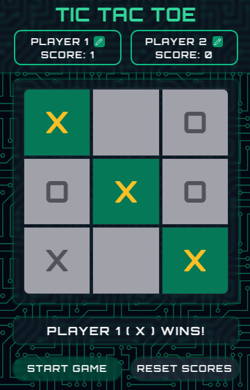

<a id="readme-top"></a>

<h1 align="center">Project Tic Tac Toe</h1>

<!-- PROJECT LOGO -->
<br />
<div align="center">
  <a href="https://github.com/github_username/repo_name">
    
  </a>
<br />
  <p>
A simple Tic Tac Toe game built with JavaScript, HTML, and CSS. This project is part of The Odin Project curriculum and demonstrates the use of modular JavaScript, event handling, and DOM manipulation.
  </p>
</div>

<!-- TABLE OF CONTENTS -->
<details>
  <summary>Table of Contents</summary>
  <ol>
    <li>
      <a href="#about-the-project">About The Project</a>
      <ul>
        <li><a href="#built-with">Built With</a></li>
      </ul>
    </li>
    <li>
      <a href="#getting-started">Getting Started</a>
      <ul>
        <li><a href="#prerequisites">Prerequisites</a></li>
        <li><a href="#installation">Installation</a></li>
      </ul>
    </li>
    <li><a href="#usage">Usage</a></li>
    <li><a href="#acknowledgments">Acknowledgments</a></li>
  </ol>
</details>

<!-- ABOUT THE PROJECT -->

## About The Project

This project is a classic Tic Tac Toe game where two players take turns marking spaces on a 3x3 grid. The game includes features like win detection, tie detection, score tracking, player name editing, and the ability to reset the game or scores. The UI is styled using Tailwind CSS and Google Fonts, with a background pattern from Hero Patterns.

<p align="right">(<a href="#readme-top">back to top</a>)</p>

### Built With


<p align="right">(<a href="#readme-top">back to top</a>)</p>

<!-- GETTING STARTED -->

## Getting Started

To get a local copy of this project up and running, follow these steps.

### Prerequisites

- A modern web browser (e.g., Chrome, Firefox, Safari).

- No additional dependencies are required.

### Installation

1. Clone the repo
   ```sh
   git clone https://github.com/BatetDev/project-tic-tac-toe.git
   ```
2. Open the index.html file in your browser to play the game.

<p align="right">(<a href="#readme-top">back to top</a>)</p>

<!-- USAGE EXAMPLES -->

## Usage

You can play the game directly in your browser by visiting the live demo:
👉 [Tic Tac Toe Live Demo](https://batetdev.github.io/top-project-tic-tac-toe/)

- **Start the Game**: Click the "Start Game" button to begin.

- **Play**: Players take turns clicking on the grid to place their markers (X or O).

- **Edit Player Names**: Click the edit icon next to a player's name to change it.

- **Reset Scores**: Click the "Reset Scores" button to reset both players' scores to zero.

- **Restart the Game**: Click the "Restart Game" button to clear the board and start a new game.

<p align="right">(<a href="#readme-top">back to top</a>)</p>

<!-- CONTACT -->

## Contact

 [@BatetDev](https://x.com/BatetDev)
 [Francisco Batet](https://www.linkedin.com/in/francisco-batet-ab7274298/)
 batet.francisco@gmail.com

<p align="right">(<a href="#readme-top">back to top</a>)</p>

<!-- ACKNOWLEDGMENTS -->

## Acknowledgments

- [The Odin Project](https://www.theodinproject.com/) - For providing the project idea and guidance.
- [Hero Patterns](https://heropatterns.com/) - For the SVG background pattern.
- [Lucide Icons](https://lucide.dev/) - For the edit icons.

<p align="right">(<a href="#readme-top">back to top</a>)</p>
